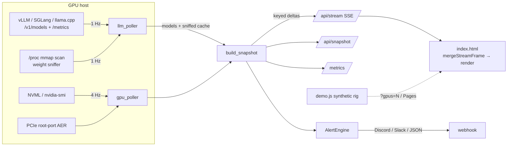

# Architecture

One process, two files, no database. `app.py` collects and serves;
`static/index.html` renders. Everything else is deployment convenience.



## Two cadences, one snapshot

- **`gpu_poller` (4 Hz default)** — NVML reads fanned out per-device on a
  thread pool; falls back to `nvidia-smi` subprocesses if the binding or
  driver is unusable, and recovers NVML later. Builds the full snapshot,
  pushes stream deltas, feeds the alert engine.
- **`llm_poller` (1 Hz)** — HTTP probes of configured + discovered endpoints,
  then the weight sniffer. Runs entirely off-thread and only updates caches,
  so a hung model server can never stall GPU telemetry.

Slow NVML calls (temperature, fans, processes) are sub-cached at 1 Hz inside
the fast tick; static device facts (name, UUID, PCIe caps, power limit) are
read once.

## Discovery, in order of strength

1. **Configured endpoints** (`[[endpoints]]`) — scraped for `/v1/models` and
   Prometheus counters; TPS is computed from token-counter deltas against the
   scraper's own previous sample, so cadence changes never skew rates.
2. **Dynamic endpoints** — the sniffer reports listening ports per serving
   process; any port that answers `/v1/models` is promoted to a scraped
   endpoint with zero configuration.
3. **Weight sniffer** — any GPU compute process mmap-holding ≥64 MB of
   `.safetensors/.gguf/.pt/...` is reported with owning app, VRAM, GPUs,
   weight files, and — when the weights resolve to a local HF-style dir —
   full architecture intel. Model loads in progress get realtime telemetry
   (VRAM fill vs. expected weights, disk read rate of the backing volume,
   loader CPU, staging RSS, ETA) read from world-readable /proc only.

GPU ↔ model attribution walks each compute PID's ancestor cmdlines, so
`docker exec`'d workers, launcher scripts, and TP worker trees all attribute
to the right endpoint.

## The stream protocol

`GET /api/stream` (SSE). First event: the complete snapshot. Every event
after: a keyed delta —

```jsonc
{
  "type": "update",
  "generated_at": "...", "uptime_seconds": 123.4,
  "gpus": [{ "index": 3, "temperature_c": 71.0 }],   // changed fields only
  "gpu_remove": [7],                                  // hot-unplug
  "totals": { "total_tps": 812.3 },                   // changed fields only
  "models": [...], "sniffed": [...],                  // only on revision bump
  "history": {                                        // 1 Hz: ONE point per series
    "max_points": 180,
    "gpus": { "0": { "util": 97.2, "mem": 88.1, "power": 91.0, "temp": 74.0 } },
    "totals": { "total_tps": 812.3 }
  }
}
```

The client (`mergeStreamFrame`) applies patches by GPU index, appends history
points with a ring-buffer cap, and re-renders only what a frame touched
(dirty GPU set, model/history revision counters). Slow consumers get their
oldest queued frame dropped rather than a stalled socket; a client-side
watchdog reconnects any stream silent for 10 s. This is why an 8- or 16-GPU
rig streams comfortably: per-tick wire cost is proportional to what actually
changed.

Four things consume this contract: the UI, `static/demo.js` (synthetic
generator for Pages/`?gpus=N`), `tools/smoke.py`, and anything you point at
`/api/snapshot`. Change one, update all four.

## Mock rig

`BURNDECK_MOCK_GPUS=N` swaps exactly two functions — `collect_gpus` and the
endpoint scrape — for synthetic equivalents (phase-shifted waves riding a TP
job envelope). Snapshot building, deltas, auth, alerts, and metrics all run
the production path, which is what makes `tools/smoke.py` a real end-to-end
test on GPU-less CI runners.

## Frontend

Single page, no framework, no build step. Canvas sparklines and SVG gauges
are updated in place (text/attr writes are diffed before touching the DOM);
GPU cards are content-visibility virtualized and chart redraws gate on an
IntersectionObserver. Themes are WebGL fragment shaders run by a shared
two-canvas crossfader (`runner.js`); the active shader receives smoothed
cluster drive, heat, and event pulses as uniforms. The event engine mirrors
the server's hysteresis thresholds and renders a capped, TTL'd ticker.

## Security posture

Read-only by construction: the process queries NVML and HTTP endpoints; it
exposes no mutation routes. Auth is an HMAC(cookie) gate in middleware with
an allowlist of public prefixes (`/login`, `/healthz`, theme assets,
optionally `/metrics`). Secrets never ship in the repo: session key and
generated credentials are runtime files (0600, gitignored), and the config
template contains no real values.
